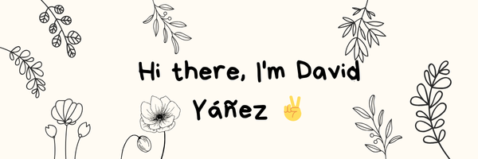

I am a Computer Science Engineer graduate and a proud member of 42 Madrid, an innovative coding academy that emphasizes peer-to-peer learning and project-based education. As part of 42’s international network, I collaborate with peers worldwide on innovative and real-world projects, fostering both technical and interpersonal skills. I’m deeply interested in expanding my knowledge and discovering new fields in the industry.

- 🧐 I am currently interested in almost every area of computer science and am actively expanding my skills in every field.
- 📈 I'm always looking to improve my coding practices and explore the latest tools and technologies.

###  My Skills

 
  &emsp; 
    
  &emsp;
    
  &emsp;
     
  &emsp;
    
  &emsp;
	
  &emsp;
	
  &emsp;

---

### Connect with me!

  
  

